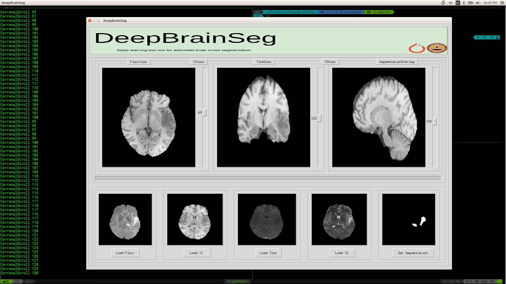
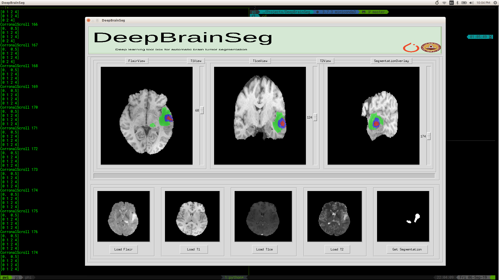

# DeepBrainSeg

[](https://travis-ci.org/koriavinash1/DeepBrainSeg)
[](https://badge.fury.io/py/DeepBrainSeg)
[](https://opensource.org/licenses/MIT)


This repo utilize a ensemble of 2-D and 3-D fully convoultional neural network (CNN) for segmentation of the brain tumor and its constituents from multi modal Magnetic Resonance Images (MRI). The dense connectivity pattern used in the segmentation network enables effective reuse of features with lesser number of network parameters. On the BraTS validation data, the segmentation network achieved a whole tumor, tumor core and active tumor dice of 0.89, 0.76, 0.76 respectively.

## Installation

PyPi based installation:

> python version: 3.5

> installation: ```pip install DeepBrainSeg```

or 

```
git clone https://github.com/koriavinash1/DeepBrainSeg.git
cd DeepBrainSeg
python3 setup.py install
```
<hr>

# Pipeline


# Results


# UI
We also provide UI based tool for tumor segmentation visualization. It can be used by running the following commands after cloning the repo.
```
cd ui
python3 DeepBrainSegUI.py
```



## Python API usage

### Basic usage

> for data in BraTs format
```
from DeepBrainSeg import deepSeg
segmentor = deepSeg(quick=True)
segmentor.get_segmentation_brats(path)
```

<hline>

> for other formats
```
from DeepBrainSeg import deepSeg
t1_path = 
t2_path = 
t1ce_path = 
flair_path = 

segmentor = deepSeg(quick=True)
segmentor.get_segmentation(t1_path, t2_path, t1ce_path, flair_path, save = True)
```

<hline>

# Steps followed for inference:

+ Our algorithm makes use of ANTs framework for mask generation. First call deepSeg class build ANTs framework locally in /tmp/DeepBrainSeg

+ Final segmentation is the result of ensemble of 4 different models:
    
    + ABLNet (modelABL.py, Air brain Lesion Network)

    + 3DBrainNet (model3DBNET.py, 3D multiresolution CNN)
    
    + Tiramisu2D (modelTis2D.py, 57 layered 2D CNN)
    
    + Tiramisu 3D (modelTir3D.py, 57 layered 3D CNN)

+ Extensive documentation will be uploaded soon, along with transfer learning framework

+ More details about network architecture and training procedure can be found [here](https://link.springer.com/chapter/10.1007/978-3-030-11726-9_43)

### For training code please refer this [repo](https://github.com/koriavinash1/BraTs2018)

# Citation

If you use some of our work, please cite our work:

```
@inproceedings{kori2018ensemble,
  title={Ensemble of Fully Convolutional Neural Network for Brain Tumor Segmentation from Magnetic Resonance Images},
  author={Kori, Avinash and Soni, Mehul and Pranjal, B and Khened, Mahendra and Alex, Varghese and Krishnamurthi, Ganapathy},
  booktitle={International MICCAI Brainlesion Workshop},
  pages={485--496},
  year={2018},
  organization={Springer}
}
``` 

## Contact 

* Avinash Kori (avinashgkori@smail.iitm.ac.in or koriavinash1@gmail.com)
